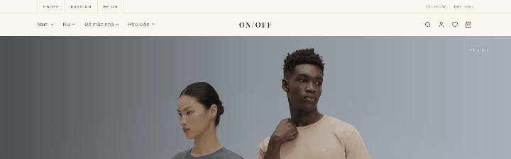
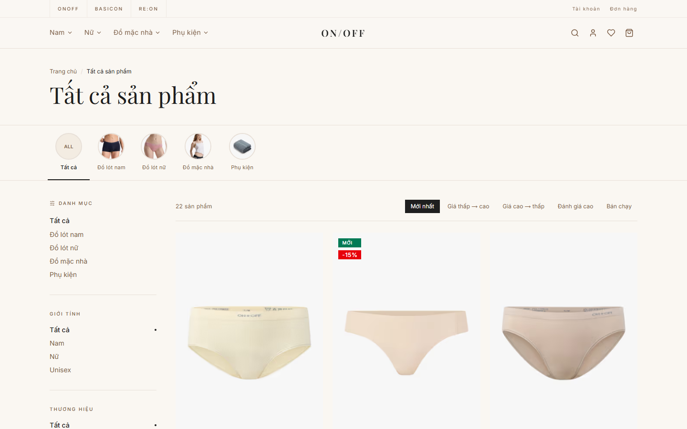
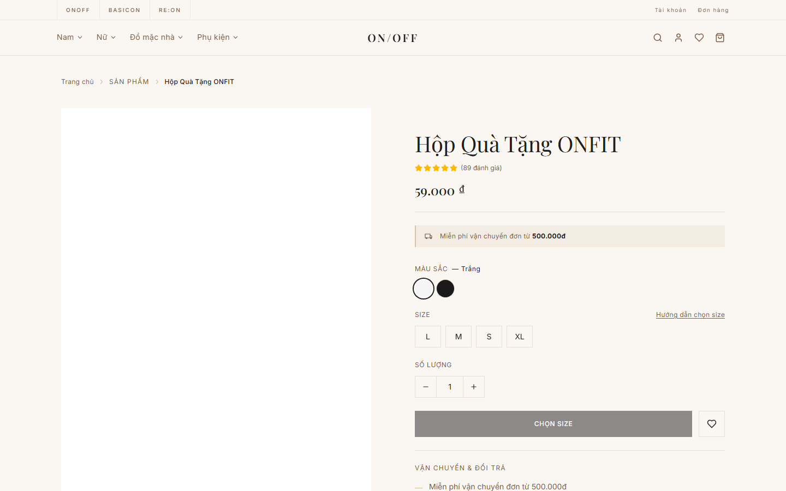
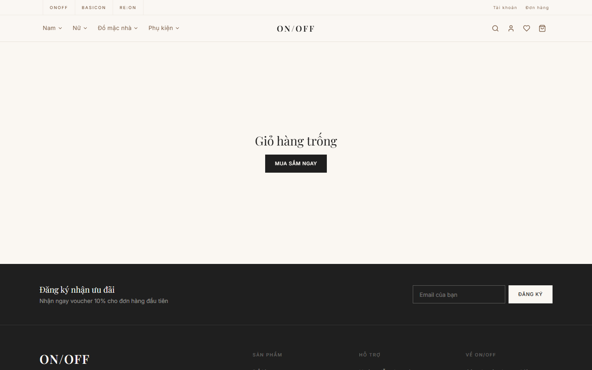
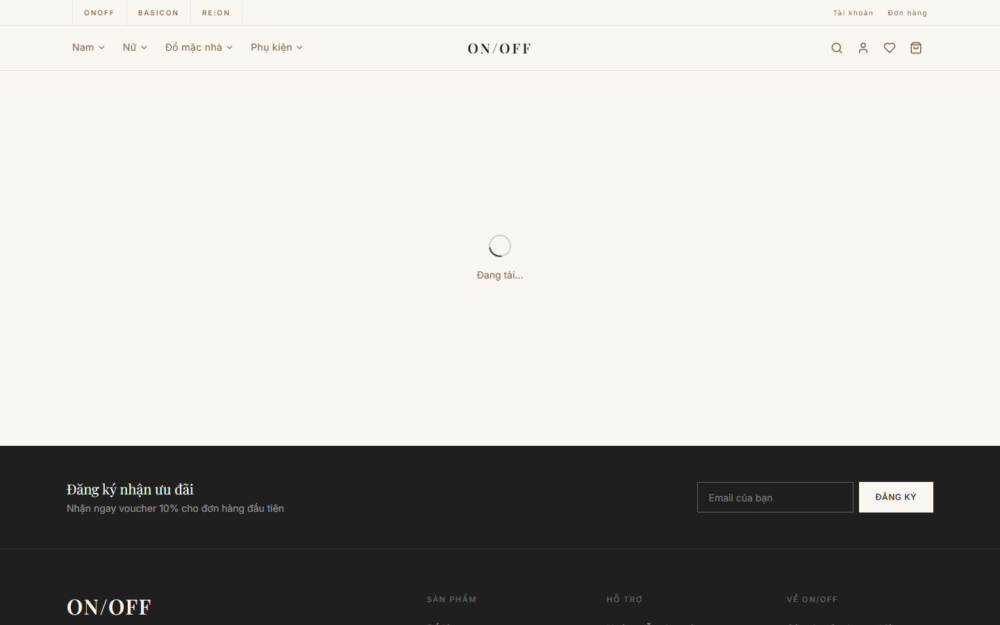

<p align="center">
  
</p>

<h1 align="center">ON/OFF</h1>

<p align="center">
  <strong>Fashion E-commerce Platform</strong><br/>
  Nền tảng thương mại điện tử thời trang
</p>

<p align="center">
  <a href="#features">Features</a> •
  <a href="#tech-stack">Tech Stack</a> •
  <a href="#getting-started">Getting Started</a> •
  <a href="#deployment">Deployment</a> •
  <a href="#contributing">Contributing</a>
</p>

<p align="center">
  
  
  
  
  
</p>

---

## Screenshots

<p align="center">
  
  <br/><em>Homepage scroll experience</em>
</p>

<table>
  <tr>
    <td></td>
    <td></td>
  </tr>
  <tr>
    <td align="center"><em>Homepage with brand showcase</em></td>
    <td align="center"><em>Product catalog with filters</em></td>
  </tr>
  <tr>
    <td></td>
    <td></td>
  </tr>
  <tr>
    <td align="center"><em>Product detail with size/color selection</em></td>
    <td align="center"><em>Checkout with payment methods</em></td>
  </tr>
  <tr>
    <td></td>
    <td></td>
  </tr>
  <tr>
    <td align="center"><em>Admin dashboard with analytics</em></td>
    <td align="center"><em>Responsive mobile design</em></td>
  </tr>
</table>

---

## Overview

ON/OFF is a full-featured fashion e-commerce platform specializing in underwear, loungewear, and fashion accessories. Built with modern web technologies for performance, accessibility, and a premium shopping experience.

**Tiếng Việt:** ON/OFF là nền tảng thương mại điện tử thời trang chuyên về đồ lót, đồ mặc nhà và phụ kiện. Xây dựng bằng công nghệ web hiện đại, tối ưu hiệu suất và trải nghiệm mua sắm cao cấp.

## Features

- **Product Catalog** — Browse by category, filter by size/color/price, full-text search
- **Shopping Cart** — Persistent cart with real-time updates, coupon support
- **Wishlist & Compare** — Save favorites, compare products side-by-side
- **User Accounts** — Registration, login, order history, address management
- **Checkout** — Multi-step checkout with order confirmation
- **Admin Dashboard** — Product/order/user management with analytics
- **Live Chat** — Integrated chat widget with quick replies
- **PWA** — Installable progressive web app with offline support
- **SEO** — JSON-LD structured data, meta tags, sitemap
- **Security** — Rate limiting, CSP headers, HSTS, input validation

## Tech Stack

| Layer | Technology |
|-------|-----------|
| Framework | Next.js 15 (App Router, Server Components) |
| Language | TypeScript 5 (strict mode) |
| Styling | Tailwind CSS 4 |
| Database | SQLite + Prisma ORM |
| Auth | JWT (jose) + httpOnly cookies |
| State | Zustand |
| Animation | Framer Motion |
| Deployment | Docker + Nginx |

## Getting Started

### Prerequisites

- Node.js 20+
- npm 9+

### Installation

```bash
git clone https://github.com/JasonTM17/ON-OFF_JS.git
cd ON-OFF_JS
npm install
```

### Database Setup

```bash
npx prisma generate
npx prisma db push
npx prisma db seed
```

### Development

```bash
npm run dev
```

Open [http://localhost:3000](http://localhost:3000)

### Environment Variables

Create `.env` at the project root:

```env
DATABASE_URL="file:./dev.db"
JWT_SECRET="your-secret-key-minimum-32-characters"
```

Optional:

```env
N8N_WEBHOOK_URL="https://your-n8n-instance/webhook/chat"
NEXT_PUBLIC_SITE_URL="https://your-domain.com"
```

## Scripts

| Command | Description |
|---------|-------------|
| `npm run dev` | Start development server |
| `npm run build` | Production build |
| `npm start` | Start production server |
| `npm run lint` | Run ESLint |
| `npx prisma studio` | Open database GUI |
| `npx prisma db seed` | Seed sample data |

## Deployment

### Docker Compose

```bash
docker compose up -d
```

This starts the app on port `3000` behind an Nginx reverse proxy on port `80`.

### Docker Hub

```bash
docker pull nguyenson1710/onoff:latest
docker run -p 3000:3000 nguyenson1710/onoff:latest
```

### Manual

```bash
npm run build
npm start
```

## Project Structure

```
src/
├── app/                    # Pages & API routes (App Router)
│   ├── (shop)/            # Shop pages (products, cart, checkout)
│   ├── (account)/         # Account pages (profile, orders)
│   ├── (auth)/            # Authentication (login, register)
│   ├── admin/             # Admin dashboard
│   └── api/               # REST API endpoints
├── components/            # React components
│   ├── ui/               # Design system primitives
│   ├── layout/           # Header, Footer, Navigation
│   ├── product/          # Product cards, galleries
│   └── home/             # Homepage sections
├── hooks/                # Custom React hooks
├── lib/                  # Utilities (auth, db, helpers)
├── store/                # Zustand state stores
└── types/                # TypeScript type definitions
```

## Demo Accounts

Seed the database first: `npx prisma db seed`

| Role | Email |
|------|-------|
| Admin | admin@onoff.vn |
| User | user@onoff.vn |

Default passwords are set in `prisma/seed.ts`.

## Contributing

See [CONTRIBUTING.md](CONTRIBUTING.md) for development guidelines.

## Security

See [SECURITY.md](SECURITY.md) for reporting vulnerabilities.

## License

This project is licensed under the MIT License — see [LICENSE](LICENSE) for details.

## Author

**Nguyễn Sơn** — [@JasonTM17](https://github.com/JasonTM17)

---

<p align="center">
  Made with care in Vietnam 🇻🇳
</p>
